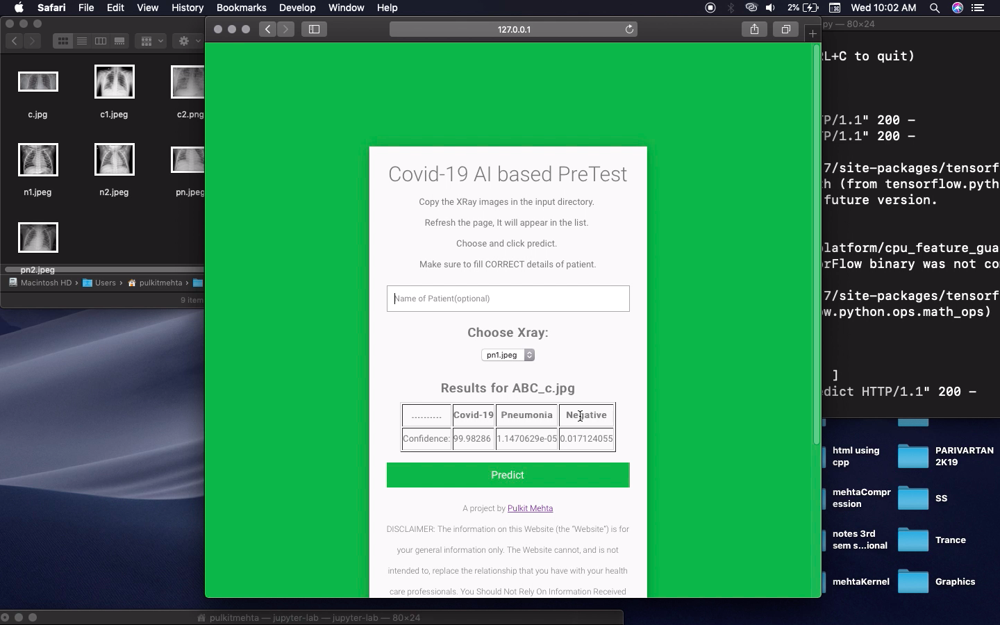
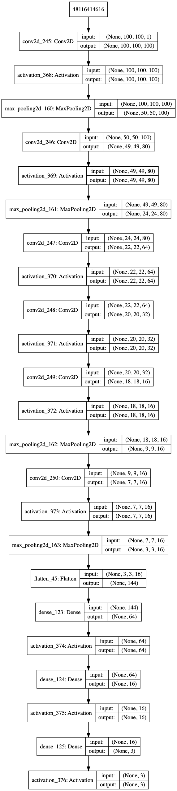
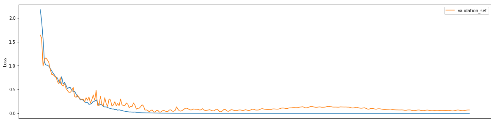
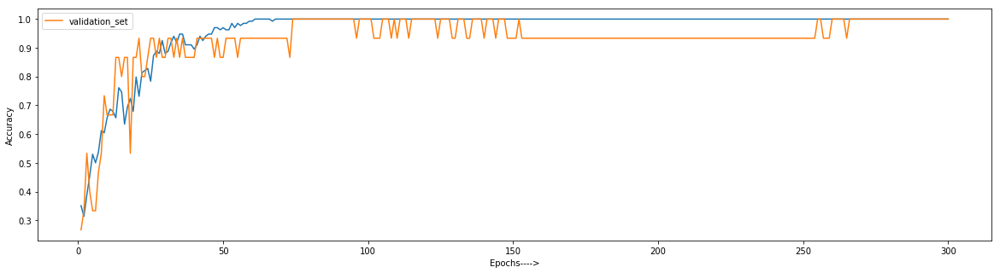
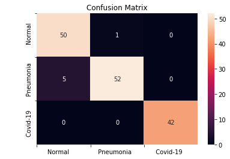
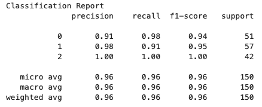

# CovidRay Project

[](https://www.python.org/)  [](https://github.com/pulkitmehta/CovidRay/blob/master/LICENSE.txt)    

[](https://github.com//pulkitmehta)  

#### An AI based Web Application which can detect COVID-19 and Pneumonia through Chest X-Rays of patient.
    





## Jump To:
- [Installation](#Installation)
- [Usage](#Usage)
- [AI Model Architecture](#CovidRayNet-Model-Architecture)
- [Performance Plots](#Performance-and-Accuracy)
- [Contributing](#Contributing)
- [Copyrights and License](#License)

## Installation

1. Install Python https://www.python.org
- Python Modules Used:
    - numpy
    - flask
    - cv2
    - webbrowser
    - threading
    - tensorflow
    - keras
- Fix Missing Packages:
    - Run command in Terminal/Command Prompt in respective virtual environment: 
    
    ```bash
    pip install <package_name>
    ```

## Usage
### Through Terminal
  Run 
```bash
python <relative_path_of_app.py>
```
### Through IPython Notebook
  Create a Notebook in project directory and run:

```python
!python app.py
```
Check further demonstration in this video: https://www.linkedin.com/feed/update/urn:li:activity:6650976906822942720/


## CovidRayNet Model Architecture
    It is a CNN based Architecture
        _________________________________________________________________
    Layer (type)                 Output Shape              Param #   
    =================================================================
    conv2d_245 (Conv2D)          (None, 100, 100, 100)     200       
    _________________________________________________________________
    activation_368 (Activation)  (None, 100, 100, 100)     0         
    _________________________________________________________________
    max_pooling2d_160 (MaxPoolin (None, 50, 50, 100)       0         
    _________________________________________________________________
    conv2d_246 (Conv2D)          (None, 49, 49, 80)        32080     
    _________________________________________________________________
    activation_369 (Activation)  (None, 49, 49, 80)        0         
    _________________________________________________________________
    max_pooling2d_161 (MaxPoolin (None, 24, 24, 80)        0         
    _________________________________________________________________
    conv2d_247 (Conv2D)          (None, 22, 22, 64)        46144     
    _________________________________________________________________
    activation_370 (Activation)  (None, 22, 22, 64)        0         
    _________________________________________________________________
    conv2d_248 (Conv2D)          (None, 20, 20, 32)        18464     
    _________________________________________________________________
    activation_371 (Activation)  (None, 20, 20, 32)        0         
    _________________________________________________________________
    conv2d_249 (Conv2D)          (None, 18, 18, 16)        4624      
    _________________________________________________________________
    activation_372 (Activation)  (None, 18, 18, 16)        0         
    _________________________________________________________________
    max_pooling2d_162 (MaxPoolin (None, 9, 9, 16)          0         
    _________________________________________________________________
    conv2d_250 (Conv2D)          (None, 7, 7, 16)          2320      
    _________________________________________________________________
    activation_373 (Activation)  (None, 7, 7, 16)          0         
    _________________________________________________________________
    max_pooling2d_163 (MaxPoolin (None, 3, 3, 16)          0         
    _________________________________________________________________
    flatten_45 (Flatten)         (None, 144)               0         
    _________________________________________________________________
    dense_123 (Dense)            (None, 64)                9280      
    _________________________________________________________________
    activation_374 (Activation)  (None, 64)                0         
    _________________________________________________________________
    dense_124 (Dense)            (None, 16)                1040      
    _________________________________________________________________
    activation_375 (Activation)  (None, 16)                0         
    _________________________________________________________________
    dense_125 (Dense)            (None, 3)                 51        
    _________________________________________________________________
    activation_376 (Activation)  (None, 3)                 0         
    =================================================================
    Total params: 114,203
    Trainable params: 114,203
    Non-trainable params: 0
    _________________________________________________________________
    
    



# Performance and Accuracy

    Loss Decay:


    Accuracy:


    Confusion Matrix:






## Contributing
Pull requests are welcome. For major changes, please open an issue first to discuss what you would like to change.

Please make sure to update tests as appropriate.


## License

    MIT License

    Copyright (c) 2020 Pulkit Mehta

    Permission is hereby granted, free of charge, to any person obtaining a copy
    of this software and associated documentation files (the "Software"), to deal
    in the Software without restriction, including without limitation the rights
    to use, copy, modify, merge, publish, distribute, sublicense, and/or sell
    copies of the Software, and to permit persons to whom the Software is
    furnished to do so, subject to the following conditions:

    The above copyright notice and this permission notice shall be included in all
    copies or substantial portions of the Software.

    THE SOFTWARE IS PROVIDED "AS IS", WITHOUT WARRANTY OF ANY KIND, EXPRESS OR
    IMPLIED, INCLUDING BUT NOT LIMITED TO THE WARRANTIES OF MERCHANTABILITY,
    FITNESS FOR A PARTICULAR PURPOSE AND NONINFRINGEMENT. IN NO EVENT SHALL THE
    AUTHORS OR COPYRIGHT HOLDERS BE LIABLE FOR ANY CLAIM, DAMAGES OR OTHER
    LIABILITY, WHETHER IN AN ACTION OF CONTRACT, TORT OR OTHERWISE, ARISING FROM,
    OUT OF OR IN CONNECTION WITH THE SOFTWARE OR THE USE OR OTHER DEALINGS IN THE
    SOFTWARE.


   [MIT](https://choosealicense.com/licenses/mit/)


